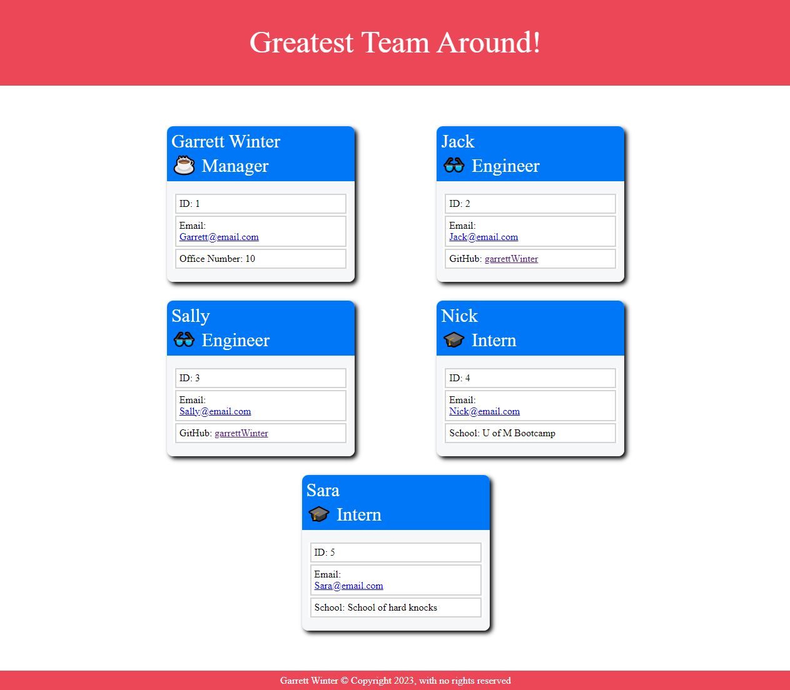
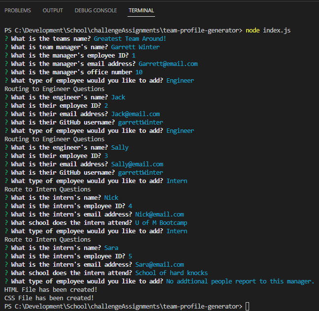
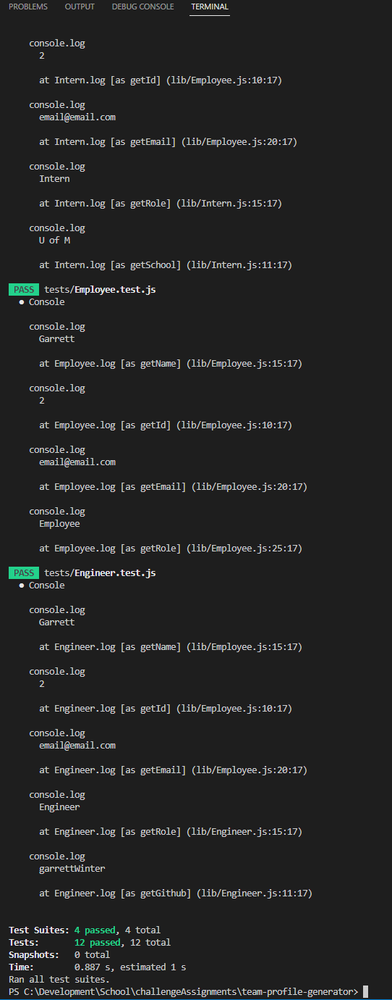

# Team Profile Generator

## Badges

## Description

Below are short descriptions explaining the what, why, and how of this project.

- What was your motivation?
    - To make it easier for teams to be able to find team specific details.
    - Make an easy-to-use application that can take employee details and generate a preformatted document.

- What problem does this application solve?
    - This application helps to quickly create a team roster with role specific details.

- What did you learn while working on this?
    - How to use Jest for test cases
    - How to export functions more cleanly into separate files and folders.
    - How to use classes, sub-classes, and constructors.
    - How to organize files for a cleaner workflow.
  
## Table of Contents

 - [Badges](#badges)
 - [Description](#description)
 - [Installation](#installation)
 - [Usage](#usage)
 - [License](#license)
 - [Features](#features)
 - [Tests](#tests)

## Installation
  
Here is some information that you will need to be able to install and properly work this application:
  - Make a copy of this repository.
  - Open this application and run "npm i" to install inquirer and jest.

## Usage
  
Here are some details on how this application can be used:
  - Once installed, open this application in your CLI and run "node server.js".
      
Below a screenshot(s) of the application:
  - 
  - 
  - 
  
Below a Video Demo of the application:
  - A demo of the video can be found at (https://garrettwinter.github.io/team-profile-generator/assets/media/Team-Profile-Generator.webm).

## License

The MIT license is being used for this application. For more information you can go to the following URL.
  - https://opensource.org/licenses/MIT

## Features

Some of the main features of this application are:
  - This application will allow you to generate team rosters webpage by follow easy prompts.
  - This application had tests that can be run to validate that the Employee classes (Employee, Manager, Engineer, and Intern).